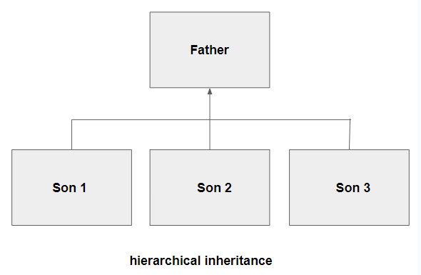

# Inheritance_and_its_types Learing Order:

1. Single_Inheritance.py
2. Multiple_Inheritance.py
3. Multi_level_Inheritance.py
4. hierarchical inheritance.py
5. Hybrid_Inheritance.py


## Note:

### Inheritance Concept:

1. Father Property to his son.
2. Son can access his Father property.

### Types of inheritance:

1. Single Inheritance
2. Multiple Inheritance
3. multi-level Inheritance
4. hierarchical inheritance
5. Hybrid Inheritance


### 1. Single Inheritance:

 Here is an Single Inheritance image:

   

Here son can inherits all the property from his father.

    ```python
    # Single Inheritance
    # Let's consider there is a father and a son. Here son has all rights to use the father wealth (money, car, home, business etc.)

    class father():

        def money(self):
            print ("Dad's money....")

        def car(self):
            print ("Dad's Car....")

    # Here Son class inherits from the father class 
    class son(father):

        def bike(self):
            print ("son's bike")


    jackie=son()
    jackie.money()    # o/p:  Dad's money....
    jackie.car()      # o/p:  Dad's Car....
    jackie.bike()     # o/p:  son's bike
    ```
### 2. Multiple Inheritance

 Here is an Multiple Inheritance image:

   

Here son can inherits all the property from his father and mother.

    ```python
    # Multiple Inheritance
    # Let's consider there is a father, mother and a son. Here son has all rights to use the father and mother wealth (money, car, home, business etc.)

    class dad():

        def money(self):
            print ("Dad's Money.....")


    class mom():

        def gold(self):
            print ("Mom's Gold jewel.....")

    # Here Son class inherits from the father and mother class 
    class son(dad, mom):

        def bike(self):
            print ("Son's Bike.....")


    jackie=son()
    jackie.money()    # o/p:  Dad's Money.....
    jackie.gold()     # o/p:  Mom's Gold jewel.....
    jackie.bike()     # o/p:  Son's Bike.....
    ```

### 3. multi-level Inheritance

 Here is an multi-level Inheritance image:

   

Here son can inherits all the property from his father and grandfather. And Father can inherits all the property from his father (grandfather).

    ```python
    # Multi-level Inheritance
    # Let's consider there is a father, grandfather and a son. Here son has all rights to use the father and grandfather wealth (money, car, home, business etc.).
    # And father has all rights to use his father wealth (money, car, home, business etc.).

    class grandfather():

        def land(self):
            print("grandpa's land....")

    class father(grandfather):

        def money(self):
            print ("Dad's money....")

    class son(father):

        def bike(self):
            print ("son's bike")


    lee=father()
    lee.land()       # o/p:  grandpa's land....
    lee.money()      # o/p:  Dad's money....

    jackie=son()
    jackie.land()    # o/p:  grandpa's land....
    jackie.money()   # o/p:  Dad's money....
    jackie.bike()    # o/p:  son's bike


    ```


### 4. hierarchical inheritance

 Here is an hierarchical Inheritance image:

   

Here son1, son2, son3 can inherits all the property from their father.

    ```python
    # hierarchical Inheritance
    # Let's consider there is a father, son1, son2 and son3. Here son's has all rights to use their father wealth (money, car, home, business etc.).

    class father():
        def money(self):
            print ("Dad's money....")

    class son1(father):
        def bike(self):
            print ("first son's bike")

    class son2(father):
        def gold(self):
            print ("second son's gold")

    class son3(father):
        def laptop(self):
            print ("third son's laptop")

    jackie=son1()
    jackie.money()   # o/p:  Dad's money....
    jackie.bike()    # o/p:  first son's bike

    tony=son2()
    tony.money()     # o/p:  Dad's money....
    tony.gold()      # o/p:  second son's gold

    lee=son3()
    lee.money()      # o/p:  Dad's money....
    lee.laptop()     # o/p:  third son's laptop

    ```

### 5. Hybrid Inheritance


